# HTTP

**Протокол передачи гипертекста (HyperText Transfer Protocol - HTTP)** - это *прикладной протокол* ждя передачи
гипертекстовых документов, таких как HTML. Он создан для связи между веб-браузером и веб-сервисами, хотя в принципе HTTP
может использоваться и для других целей. Протокол следует классической клиент-серверной модели, когда клиент открывает 
соединение для создания запроса, а затем ждёт ответа. HTTP - это *протокол без сохранения состояния*, то есть сервер
не сохраняет никаких данных (состояние) между двумя парами "запрос-ответ". Несмотря на то, что HTTP основан на TCP/IP, 
он также может использовать любой другой протокол *транспортного уровня* с гарантированной доставкой.

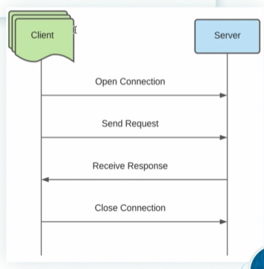

Каждое HTTP-сообщение, независимо от того, следует оно от клиента к серверу(request) или от сервера к клиенту(response),
состоит из трёх основных частей:  
• Стартовая строка  
• Заголовок (header)  
• Тело сообщения (body)  

*Это логическое разбиение, поскольку всё идёт одним куском информации*

## Стартовая строка

*Стартовая строка определяет тип сообщения, в которой указываются следующие данные (general):*  
**a) Request:**  
• метод (GET, POST, PUT, DELETE, etc)  
• адрес (URL)  
• версия протокола (HTTP/1.1, HTTP/2)

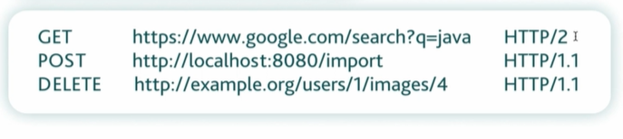

**HTTP-метод - это название операции, которая должна быть выполнена HTTP-запросом (request):**  
• GET (когда мы хотим только получить информацию)  
• POST (когда мы хотим добавить что-то на сервер или изменить там что-то)  
• PUT (полное обновление уже существующей записи)  
• DELETE (удаление информации с сервера)  
• PATCH (изменение части информации)  
• HEAD  
• CONNECT  
• OPTIONS  
• TRACE  

**Адрес(URL - Uniform Resource Locator) состоит из 4 основных частей:**

• протокол  
• доменное имя или IP-адрес (с портом)  
• адрес ресурса (по указанному доменному имени или IP-адресу)  
• список параметров

**b) Response**  
• версия протокола (HTTP/1.1, HTTP/2)  
• код состояния (1xx, 2xx, 3xx, 4xx, 5xx)  
• текстовое пояснение  

**Код состояния(Status Code) - цифровой код ответа сервера, состоящий из трёхзначного числа, первая цифра которого
означает класс состояния**

*Всего существует 5 классов состояния: 1xx, 2xx, 3xx, 4xx, 5xx*

**1xx - информация о состоянии процесса передачи**  
*Informational Status code*  

• 100 - Continue  
• 101 - Switching Protocols  

**2xx - информация об успешном принятии запроса и его обработке**

• 200 - OK  
• 201 - Created  
• 204 - No Content  

**3xx - информация о том, что необходимо выполнить запрос по другому адресу, указанному в заголовке location (header)**  
*Redirection*

• 301 - Moved Permanently  
• 302 - Moved Temporarily  

**4xx - информация об ошибках со стороны клиента**

• 401 - Unauthorized  
• 403 - Forbidden  
• 404 - Not Found (Когда URL, по которому мы переходим, не существует)  

**5xx - информация об ошибках на стороне сервера**

• 500 - Internal Server Error  
• 503 - Service Unavailable  
• 503 - Gateway Timeout  

## Заголовок

*Заголовок(Header) - характеризует тело сообщения(body) и параметры его передачи в виде "header_name:
header_value"*.  

**Другими словами, является метаинформацией HTTP-сообщения (названия заголовков не чувствительны к регистру).**

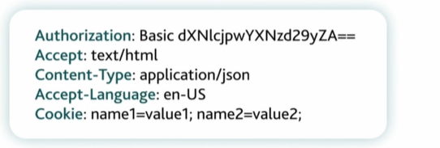

## Тело сообщения

*Тело сообщения(Body) - это непосредственно пересылаемые данные HTTP-сообщением.*  
Отделяется от заголовка(header) пустой строкой.

Сами данные могут быть совершенно любые, например:

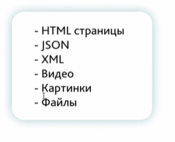

## Примеры:

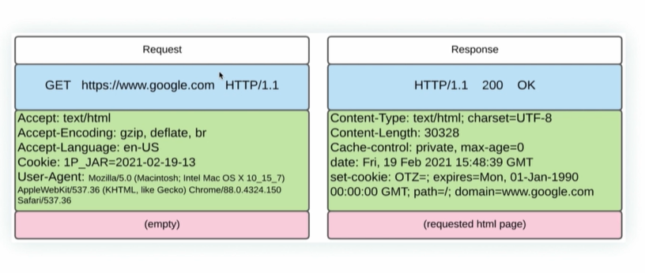

## Моменты Request:

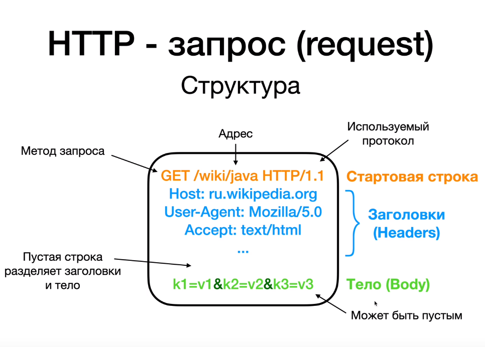

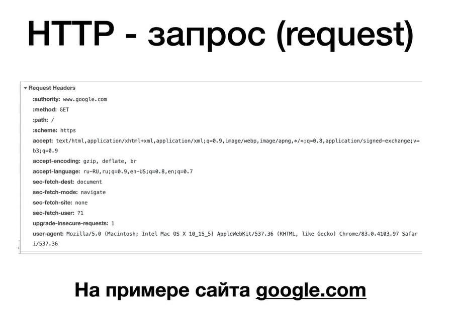

## Метод GET

• От англ. "Получить"  
• Самый используемый запрос (переход по адресу, переход по ссылке, поисковый запрос в Google, открытие видео на YouTube,
и т.д.)  
• Идемпотентный (ничего не меняет на сервере)  
• Тело запроса пустое  

### Параметры GET-запроса

Параметры нужны для передачи информации от клиента к серверу во время запроса.

• Параметры GET-запроса передаются в самом URL после знака **?** в формате **ключ=значение** (тело GET-запроса всегда
пустое).  
• Несколько параметров (пар ключ=значение) разделяются **&**.

## POST-запрос

• От англ. "Публиковать"  
• Цель запроса - изменить что-то на сервере (чаще всего - добавить что-нибудь)  
• Часто используется для отправки данных с веб-форм, но не только для этого (создать новую учётную запись, твитнуть
что-нибудь, добавить запись в сообщество, загрузить фото в IG, и т.д.)  
• Все параметры хранятся в теле запроса

### Параметры POST-запроса

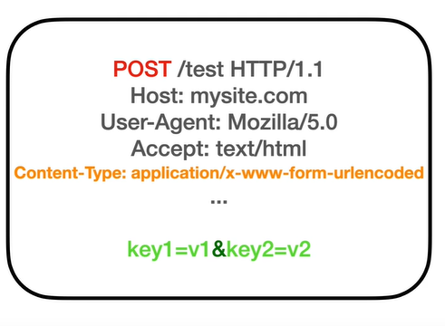

• Все параметры закодированы в теле запроса  
• Content-Type может быть разный (JSON, XML, и т.д.)  
• В зависимости от Content-Type меняется и формат данных в теле запроса

## Сравнение GET и POST:

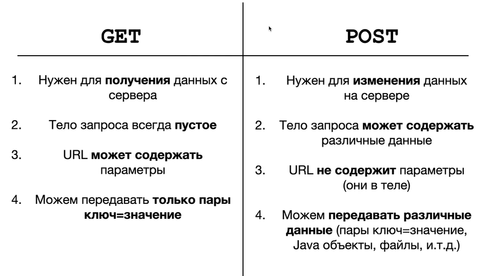

## Моменты Response

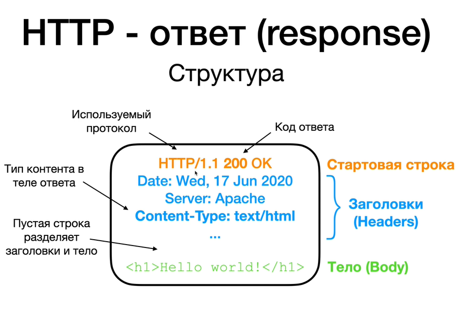

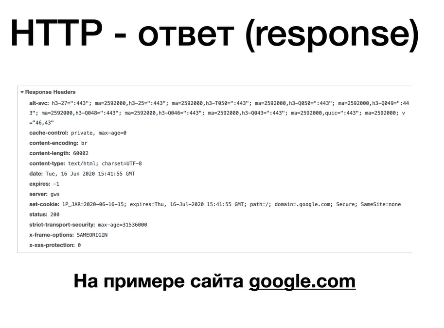